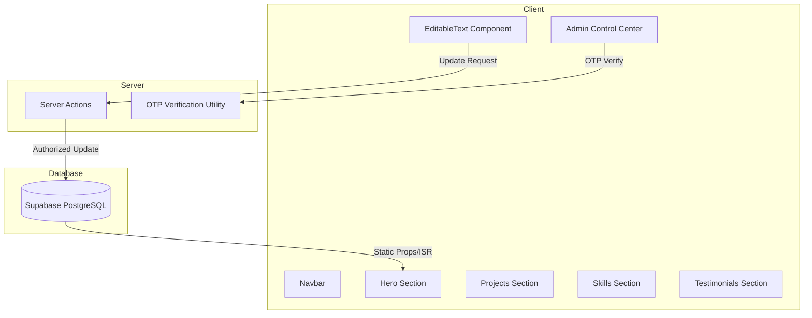

# 시스템 설계 및 아키텍처 (ARCHITECTURE.md)

이 문서는 **Premium Developer Portfolio 2026** 프로젝트의 기술적 설계와 구조를 설명합니다.

## 1. 개요 (Overview)

본 프로젝트는 단순한 정적 포트폴리오를 넘어, 관리자가 실시간으로 콘텐츠를 수정하고 즉각적으로 반영할 수 있는 **Live Editing** 시스템을 핵심으로 합니다. 고도의 보안(OTP)과 시각적 탁월함(3D UI)을 동시에 추구합니다.

## 2. 기술 스택 (Technical Stack)

- **Frontend**: Next.js 15 (App Router), TypeScript
- **State Management**: React Context API (Admin State), `next-intl` (Locale State)
- **Database/Auth**: Supabase (PostgreSQL, RLS, Edge Functions)
- **UI/UX**: Tailwind CSS v4, shadcn/ui, Framer Motion
- **Security**: `otplib` (TOTP), Supabase Row Level Security (RLS)

## 3. 시스템 아키텍처 (System Architecture)

### 3.1. 컴포넌트 구조

### 3.2. 실시간 편집 워크플로우 (Live Editing Workflow)
1. **관리자 인증**: 숨겨진 `AdminControl` 버튼을 통해 OTP 입력.
2. **상태 활성화**: `AdminProvider`가 `isAdmin` 및 `isEditMode` 상태를 전역으로 공급.
3. **인라인 편집**: `EditableText` 컴포넌트가 `contentEditable` 모드로 전환.
4. **저장**: 포커스 아웃 또는 수동 저장 시 Next.js **Server Action** 호출.
5. **DB 반영**: Supabase의 `site_data` 테이블에 `upsert` 수행.
6. **Revalidation**: `revalidatePath`를 통해 변경된 내용을 즉시 배포 버전에 반영.

## 4. 데이터베이스 스키마 (Database Schema)

### 4.1. `site_data` 테이블
전역적인 텍스트 및 설정값을 저장합니다.
- `id`: UUID (Primary Key)
- `locale`: 'en' | 'ko'
- `section`: 섹션명 (Hero, Testimonials 등)
- `key`: 필드 식별자 (title, subtitle 등)
- `value`: JSONB (실제 내용)
- `updated_at`: Timestamp

### 4.2. `projects` 및 `testimonials`
다국어 지원을 위해 메인 테이블과 `_i18n` 테이블로 분리하거나, 본 프로젝트에서는 관리 편의를 위해 `site_data` 내에서 섹션 단위로 관리할 수 있도록 설계되었습니다.

## 5. 보안 설계 (Security Design)

- **Row Level Security (RLS)**: 공용 사용자는 `SELECT`만 가능하며, `INSERT/UPDATE/DELETE`는 관리자 인증 세션이 있을 때만 허용됩니다.
- **TOTP 인증**: 서버 사이드에서 비밀키를 통해 OTP를 검증하며, 클라이언트 세션은 보안 쿠키 또는 Context 상태로 유지됩니다.
- **CSP (Content Security Policy)**: 인라인 스크립트 실행을 방지하고 보안 등급을 최상으로 유지합니다.

---
최종 수정일: 2026-01-31
작성자: Antigravity AI Assistant
